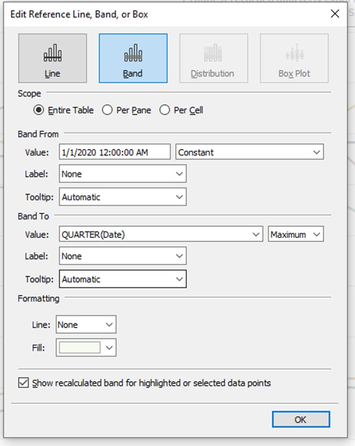

```{r setup, include=FALSE}
knitr::opts_chunk$set(echo = FALSE)
```

### 1. Critique of Visualisation


S/N| Clarity Critique                            | Suggestion               |
---|---------------------------------------------|--------------------------|
i. |*Chart title is not precise and contentious* - “Merchandise Trade of Top Six Trading Countries, 2019 – 2020” does not indicate the country the trade data is in reference to. As such, the export and import numbers from each chart hold no value. In addition, it could be an issue to label Hong Kong and Taiwan as a country. Best to clarify and retitle the chart.|Clarify in the title that the trade data is in reference to Singapore’s top 6 trading partners.|
ii.| *Axis labels are not aligned to graph title* - The x-axis for the charts indicate a timescale between 2019 to 2021. However, the title for the visual indicates 2019 – 2020. This creates confusion when interpreting the timescale of the charts and challenging to compare various figures across the countries.| Standardize the timeframe and clearly indicate the start and end time period in the chart title (e.g January 2020 – December 2021).  Similar labelling by month/quarter should be labelled on the x-axis.|
iii. |*Axis not labelled properly* - The start and end month is not indicated on the x-axis. Tick marks are missing. In addition, the label “Month of Period” is confusing. It is challenging for the reader to accurately compare how each country performed over a particular period as the timeline may differ (e.g monthly, quarterly). Unclear what the Y-axis represents (USD, SGD, tonnes, number of shipments from port?).| Use tick marks to indicate intervals on the x-axis. Re-label the x-axis to month or quarter, depending which unit is used. Y-axis should be labelled “Trade value in (S$)”.|
iv.| *Legend is incomplete* - The legend shows two colours, but the chart has three colours. The reader will be confused and left guessing what the third colour represents.| Do not use a fill. Instead, a line chart would suffice.|
v.|*Incomplete information leading to ambiguity*|When viewed as a graph, the x-axis only provides 2020 data for Japan. 2020 is labelled at the centre of the axis. This misleads the reader that only 2020 data is shown in the graph. In addition, the source of the data is not given, and its credibility will be questioned.| Japan has a narrower chart than the rest and only a single time period. Ensure that the time periods match. If data is unavailable, re-consider fleshing Japan data. Place the source of the data at the bottom of the chart. In this case “Taken from Department of Statistics (DOS) on date; https://www.singstat.gov.sg/find-data/search-by-theme/trade-and-investment/merchandise-trade/latest-data”.|

S/N| Aesthetics Critique                         | Suggestion               |
---|---------------------------------------------|--------------------------|
i.| *Overlap of colours hides data* - The reader only gets a partial picture of the data as the colour and its opacity chosen hides many data points. Reflecting on this, the charts are not useful to the reader and does not tell a story.| Do not use a chart with a colour fill. Instead use a line chart for the user to derive data points and understand the values and the story of how the imports and exports changed over time.|
ii.|*Choice of chart* -The reader needs to study each graph before comparing the figures across to understand the story. It is not reader friendly and time consuming. It would be easier if the visual was more forthcoming with the story and highlighted what the reader should take away.| The intent of the charts are unclear and hence the story is not clear. Instead of showing each trading partner’s export and import data in one chart, it may be more useful to flesh all export data in one chart and all import in another chart. Also, key global events could be indicated to flesh out how the trade has changed and the trends. The take-away from this will be clearer.|
iii.|*Font Size and Axis*- The font is small, and the dull colour choice makes it difficult to read. In addition, the x and y axis are indicated with a negative scale, even though the numbers are all within the positive scale.| Change the colours to visually draw the reader to chart and use bigger font for easy readability. Also, do away with the negative axis.|
     
### 2. Proposed Design


#### 2.1 Advantages of Proposed Design

- Clear title and commentary - The chart has a focus and highlights how trade between its largest trading partners changed after a global event.
- Clear grouping of data for easy cross referencing – Exports and imports are in separate chart. Reader is able to clearly compare the difference between the partners and the change over time
- Able to interpret the data in industry language – The timeline used is quarterly and the trade value is indicated in Singapore Dollar. These are common values used to understand trade better (usually quarterly data is analysed for performance and not monthly). 
- Aesthetically invites the reader to explore the chart - Colours are consistent throughout the dashboard and highlight the important aspects the reader should take note of.
- Relatable story and addresses concerns - Trade data is relatable to a recent global event and the change in percentage is highlighted. Reader does not need to calculate this. Furthermore, quarterly performance is easily attainable by referencing the line chart if further details are required.

### 3. Data Preparation step-by-step guide 

S/N| Action                        | Step                       |
---|-------------------------------|----------------------------|
1.|Created excel worksheets “Imports Tableau” and “Exports Tableau” for Imports and Exports to work on for data cleaning. Not recommended to overwrite original data.|{height=75%}
2.|Data Cleaning to remove unnecessary information. First, removed imports and exports data from 1976 – 2018 (inclusive). Then removed row data outside top 6 trading partners (Mainland China, Japan, Hong Kong, Malaysia, Taiwan, United States). Lastly, removed data descriptive text.| - |
3.|Data Cleaning to check data and headings. For import and export data, checked for null values and standardized units to dollars. Specifically, convert all trade values to actual and removed “million dollars” and “thousand dollars” unit. Changed headings of columns and rows.|{height=75%}
4.|Transpose table and combine Export and Import Data into a single table and create a column Export/Import.|{height=75%, width=50%}
5.|Import the file to Tableau. Checked data is in the correct format type: Date is in date format; Country trade value data is Numerical <Number (Whole)>; Import and Export Column is a string.|-|
6.|Pivot the data.     Reference: https://help.tableau.com/current/pro/desktop/en-us/pivot.htm. Pivot the data then checked data type correct and rename “Pivot Field Names” to “Country” and “Trade Value”. Change “Country” to string and “Trade Value” to number (whole).|{height=75%, width=50%} {height=50%, width=50%}
7. |Export data and save file as csv Reference: https://help.tableau.com/current/pro/desktop/en-us/save_export_data.html|{height=50%, width=50%}
8.| Import the cleaned dataset into Tableau. Ensure format is correct and data in order (no missing columns, null values)| - |
9.| Work on Import Dataset first. Go to new worksheet and re-name worksheet as Import. Then drag Country to colour. Ensure data is continuous for Year and Trade Value. Next, create a line chart with Year, Trade Value and Country.  Filter the Import/Export data by Import.| {height=50%, width=50%}  {height=50%, width=50%}|
10. | Improve the chart by adding titles, clarifying the axis, adding reference marks, and describing the data.  Add Chart Title. Then edit X and Y axis to i) appropriately title axis and ii) highlight tick marks. Thereafter, adding reference lines for when a large portion of the world was in lockdown. Given Singapore is an global trading hub and depends on free trade for its economy, it is an important timeline to flesh out and story to tell. Reference for global lockdowns: https://www.bbc.com/news/world-52103747. To be more specific with data, add reference bands. Add Label to identify reference band “Trade Post Covid Global Lockdown Peak”| {height=50%, width=50%}   {height=50%, width=50%} {height=50%, width=50%}
11. |Add percentage change between Peak covid lockdowns Q1 2020 – Q4 2020. Drag Sum Value to Detail under Marks. Select Quick Table Calculation > Percentage Difference. Select Edit Table Calculation. % change difference from Q4 2020 to Q1 2020 Drag and drop Trade values to Label.|{height=50%, width=50%}
12.|Repeat steps 9 to 11 for Exports| - |
13. |Create a dashboard. Add sheets Import and Export. Thereafter, add text object for the Title, Commentary below title and Source below the charts. Move legend below charts and Source below legend. Complete the Title, Commentary and Source commentary. Edit the text boxes for the above using the layout option on the left. Lastly, ensure entire colour scheme does not clash and modify colours and sizing for aesthetics.| - |


### 4. Dashboard
The dashboard can be viewed [here](https://public.tableau.com/views/Final__Data_vizAssingment1_Final_vF/Dashboard1?:language=en-GB&:display_count=n&:origin=viz_share_link)


### 5. Derived Insights for merchandise trade between Singapore and its top 6 trading partners between 2019 and 2020 (inclusive)

- Overall, Covid-19 had little impact on Singapore’s trade with majority performance being stronger compared to Q1 2019. 

- Imports into Singapore in Q4 2020 compared to Q1 2019 were higher for Mainland China, Taiwan, Hong Kong and Malaysia. Imports from Japan and US decreased.

- Exports to Mainland China, Hong Kong, Taiwan, Malaysia and Japan increased in Q4 2020 compared to Q1 2019. Exports to Malaysia decreased.

- China is Singapore’s largest trading partner for imports and exports for merchandise at $18.5B and $20.9B respectively.

- Post Covid-19 Global Lockdowns, only trade with US decreased across exports and imports.

- Post Covid-19 Global Lockdowns, Q4 2020 import fluctuated at a wider gap compared to exports. Growth fluctuations for import was between -9% to 79%, while exports fluctuated between -4% to 11%.

- In Q4 2020, Singapore was importing approximately the same value in merchandise from Taiwan and US.

adding 


