```{r setup, include=FALSE}
knitr::opts_chunk$set(echo = FALSE)
```

### 1. Critique of Visualisation
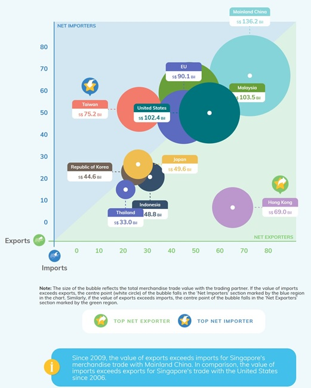

S/N| Clarity Critique                            | Suggestion               |
---|---------------------------------------------|--------------------------|
i. |*Chart has no title* - It is not clear what the reader should take away from the chart as there is no title to guide the reader through the story and the timeframe for the data. |Insert a chart title to indicate what the chart is about. For example, “Total Trade with partners from year to year”.|
ii.| *Axis labelling* - The axis does not state the units (e.g S$). This is mis-leading when referencing the circles. For example, Taiwan shows S$75.2Bil, but it is not located anywhere near the 70 mark on both axes.|  Label the axes with the units. In fact, the whole chart needs to be reworked to make it interactive. In this way the reader can interact with the chat to gather insights on the import and export trade values.|
iii.|*Differentiating by Net Importers/Exporters* - While the idea is there, it is not clear at first look what it means for circles that are in both halves. In addition, the note below the chart requires effort to understand, making the chart use less visuals and more words for explanation.  The small white circle in the centre is supposed to indicate if the partner is a net importer or exporter. This creates a confusion as the big circle is already within the net exporters/importers half of the chart. | Divide the chart into quadrants instead. Break the quadrants up into High Export High Import etc.. This is useful for the reader to understand both the import and export of the partner in-relation to one another. High and low can be measured against the average.  In addition, supplement a bubble plot with a bar chart to indicate the export/import values and the difference for users to understand net imports/exporters clearly. There is no requirement to pack everything into a single chart especially if it compromises clarity.|


S/N| Aesthetics Critique                         | Suggestion               |
---|---------------------------------------------|--------------------------|
i.| *Overlap of circles keeps you guessing what it really looks like* - The circles overlap which is fine, but because of no opacity, the readers have to form an image of the full circle in their mind and figure out how it really compares. This is not aesthetically pleasing and unnecessary work for the reader.| Use a degree of opacity to show the full circle.|
ii.| *Too many colours* - The chart does not look professional and it is a reflection of the author’s lack of clarity for what the chart is supposed to represent. Use colours to highlight the import aspects of the chart instead of colouring it everywhere. In addition, some colours look similar (EU and Thailand).| When using the quadrant approach above (as stated in Clarity), use colours to indicate which quadrant the countries fall in to different them from one another.|
iii.|*Information flow, font size and use of circles* - The information flow starts with details at the top (chart) before going broad to explain what it is about. It is not pleasing to read and refer to. The font used for the information below the chart is thin and small and hence challenging to read. In addition, some font is in caps (e.g TOP NET IMPORTER). This is aesthetically annoying. Lastly, author should be careful when using circles, as looking at big and small circles can distort the reader’s visual of how big/small the circles are.| When sharing information, start with the broad picture above before going into details (the chart). Use a standard font across and avoid caps. Do not use big and small white circles together. Re-work the chart and divide it into two interactive charts as shown in the proposed design below.|
     
### 2. Proposed Design


#### 2.1 Advantages of Proposed Design

-	Structured approach to story-telling:  Each of the charts have a purpose and story to tell. The left chart shows how the partners match up against each other both in terms of total and individual (export/import) trade value. The chart on the right provides granularity on the figures. The story is easy to retain with the animation.
-	Interactive Charts: The charts are interactive which gives the users the dexterity to perform their own analysis. For example, the user can filter by partner and date. In addition, the animation feature that was added provides a visualisation through time to understand the changes better.
-	Granular details: The charts highlight the key parts that the reader should read. For example, the additional of quadrant and related colours indicate the importance of some trading partners. In addition, for the chart of the right, the tooltip provides details of the difference in trade for each partner’s export and import. 
-	Aesthetically pleasing: The simple but purposeful charts invite the users to explore the charts and related data. 
-	Labels: The chart is well labelled and provides direction for the user. It leaves no room for ambiguity.


### 3. Data Visualisation
The dashboard can be viewed [here](https://public.tableau.com/views/Data-Viz2-SingaporesTradewithtop10partners/Singaporestradingpartners?:language=en-GB&:display_count=n&:origin=viz_share_link).


       
### 4. Data Preparation step-by-step guide 
1.	Prepare Data
a.	Download Merchandise Trade by Region/Market from the Singapore Department of Statistics https://www.singstat.gov.sg/find-data/search-by-theme/trade-and-investment/merchandise-trade/latest-data .

b.	Within the downloaded workbook, create duplicate T1 and T2 excel sheets and rename them “Imports Tableau” and “Exports Tableau”. These worksheets will be used to prepare the necessary data for the visualisation.
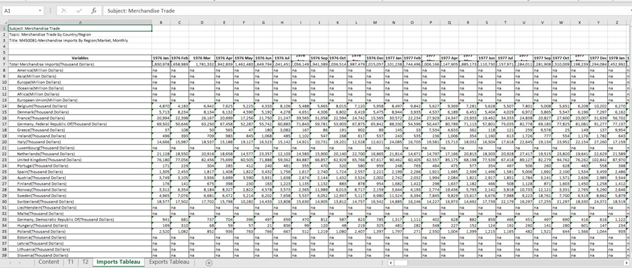
c.	Steps for both “Imports Tableau” and “Exports Tableau:
As part of data preparation, remove data outside period January 2011 – December 2020. In addition, only keep data for the following 10 partners (Thailand, Indonesia, Hong Kong, Japan, Korea, Taiwan, US, China, Malaysia, and EU). 
Remove descriptive text.

d.	Convert European Union figures from Million Dollars to Thousand dollars. Multiply the values by 1000 and paste As Value in the row. 


2.	Data Cleaning Steps for both “Imports Tableau” and “Exports Tableau
a.	Check fields for missing and null values. No missing or null values.
b.	Change headers from “Variables” to “Partners” 


c.	Change values by multiplying all values by 1000 to get values in its raw form. It will be easier to deal with within Tableau. 
d.	Copy Imports Table and transpose paste in new Worksheet. Create a column header called “Import/Export”. Label the rows as “Import. Re-name new Worksheet “Combine Import - Export”
e.	Copy Exports Table from “Exports Tableau” and transpose paste below Import table in “Combine Import - Export” worksheet. In Import/Export Column, name each the row as Export.
f.	Remove row with header “Partner” and partner names above 2011 Jan for Exports.
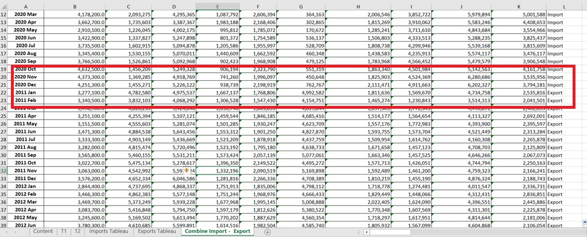

3.	Data Prep in Tableau
a.	Open Tableau and Import File into Tableau.


b.	Drag and drop “Combine Import – Export” sheet in Tableau sheet Data Source
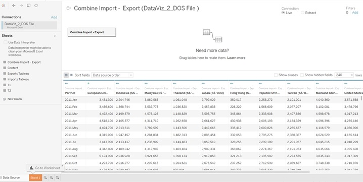
c.	Select the columns of the 10 partners (Thailand, Korea etc) and change the column format to Number (whole) by clicking on the # on the top left of the column header.Rename the column Partner to Date and change the format of column to Date.


e.	The data needs to be pivoted to build the charts. To pivot the data, select all 10 partners columns, click on the down arrow at the top right beside the column name, select pivot.

f.	Change the pivot column names to “Trading Partner” and “Trade Value (S$)”.

g.	Check that the columns are in the correct format. Date should be date format, Trading Partner and Import/Export should be a string and Trade Value should be Number (whole).
h.	Once verified, go to Data>> Export Data to CSV 
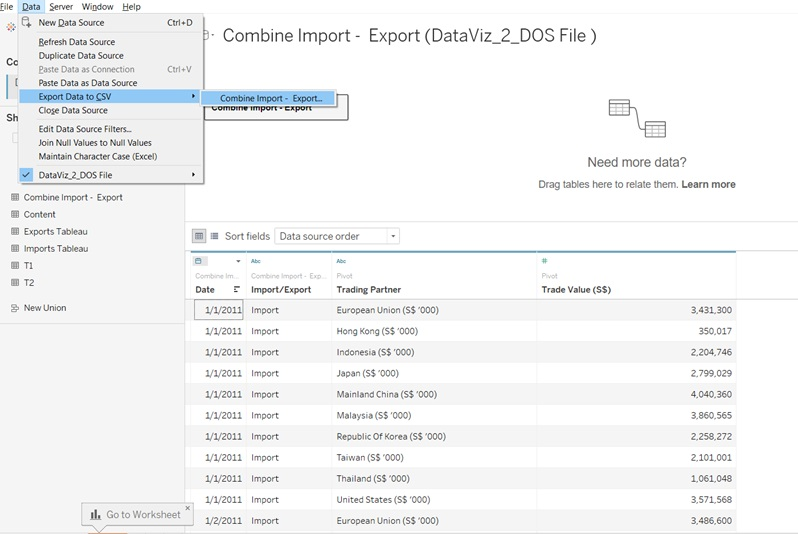


i.	Within the exported CSV file, transform data to have the following columns: i) Date ii) Trading Partner iii) Import Trade Value and iv) Export Trade Value.
j.	This will allow for quicker chart development. Save the file as an .xlsx (Excel) and not .CSV file.
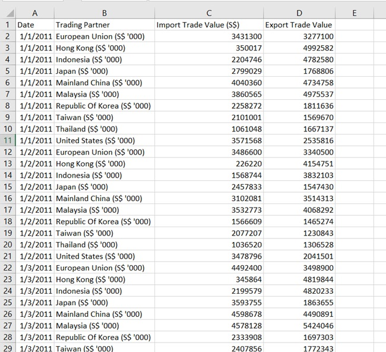

4. Building Charts
a.	Import excel file into new Tableau Book. Check all columns in the correct format as stated above. 
b.	Go to worksheet.
c.	Go to Analysis > Create Calculated Field. Create a calculated field for Total Trade. 
d.	Total Trade = [Import Trade Value (S$)]+[Export Trade Value (S$)]
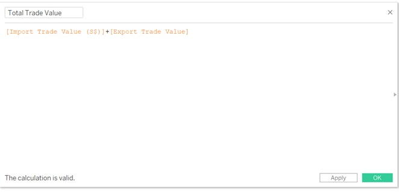
e.	Create Bubble Plot by dragging Import Trade Value to x-axis and dragging Export Trade Value to y-axis
f.	This will be the base graph.
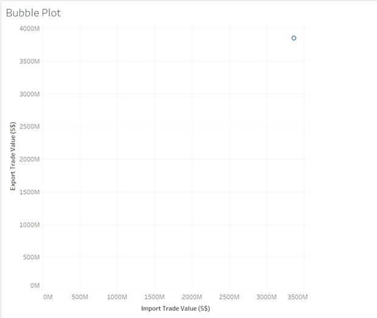
g.	Drag and drop Total Trade Value to chart. Drag and drop partners to colour. Within the Marks, choose Circle.

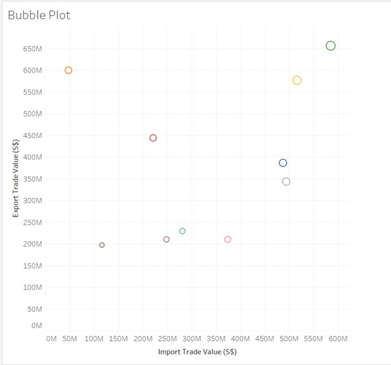{height=50%, width=50%}

{height=50%, width=50%}


5.	Improving the visual
a.	Under Marks>Size, choose a big circle size


b.	Under Marks> Colour, choose blue as the circle border.
c.	Given some circles will overlap, under Marks> Colour, change the Opacity to 75%
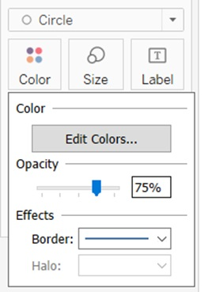
d.	Add a date filter 

•	Drag and drop Date to Filter
•	Select All Dates
•	Once done, under Filter, select year, select discrete and select Show Filter

e.	Add Country filter

•	Drag and drop Country to Filter
•	Under Filter, select show filter
f.	Under the Partner filter on the right panel, select Multiple Values Filter


6.	Diving deeper to improve story telling for visual
a.	Drag and drop Trading Partner to Label
b.	Drag and drop Total Trade Value to Label
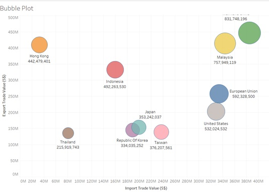

c.	Create Ranking for Import and Export and add to tooltip.

•	Go to Analysis > Create Calculated Field
•	Create Import Ranking with RANK_DENSE(SUM([Import Trade Value (S$)]),'desc')
•	Repeat and create for Export Ranking with RANK_DENSE(SUM([Export Trade Value (S$)]),'desc')

•	Drag and drop Import Ranking and Export Ranking to Tooltip
•	Select each under Marks and change Compute Using > Partners

d.	Add reference lines to show average for Imports and Exports
•	Go to Analytics and Add “Average Line”
•Add to both Sum(Import Trade) and Sum(Export Trade)


f.	Create quadrants
•	Visualise country by category quadrant “High Import, High Export”, “High Import, Low Export”, “Low Import, Low Export”, “Low Import, High Export”
•	Go to Analysis > Create Calculated Field> Create Quadrant

IF SUM([Import Trade Value (S$)]) >= WINDOW_AVG(sum([Import Trade Value (S$)]))
AND SUM([Export Trade Value (S$)]) >= WINDOW_AVG(sum([Export Trade Value (S$)]))
THEN 'High Import, High Export'

ELSEIF SUM([Import Trade Value (S$)]) <= WINDOW_AVG(sum([Import Trade Value (S$)]))
AND SUM([Export Trade Value (S$)]) <= WINDOW_AVG(sum([Export Trade Value (S$)]))
THEN 'Low Import, Low Export'

ELSEIF SUM([Import Trade Value (S$)]) >= WINDOW_AVG(sum([Import Trade Value (S$)]))
AND SUM([Export Trade Value (S$)]) <= WINDOW_AVG(sum([Export Trade Value (S$)]))
THEN 'High Import, Low Export'

ELSEIF SUM([Import Trade Value (S$)]) <= WINDOW_AVG(sum([Import Trade Value (S$)]))
AND SUM([Export Trade Value (S$)]) >= WINDOW_AVG(sum([Export Trade Value (S$)]))
THEN 'Low Import, High Export'

END


•	Drag and drop Quadrant to colour, select Compute Using > Partners
• Drag and drop Total Trade Value to size. 

7.	Touch Up
a.	Drag and drop Total Trade Value to Label
b.	Under Marks > Label > Change Label settings to Partner and Total Trade Value
c.	Edit Tooltip by clicking Tooltip. See the edits to the text in the image below.
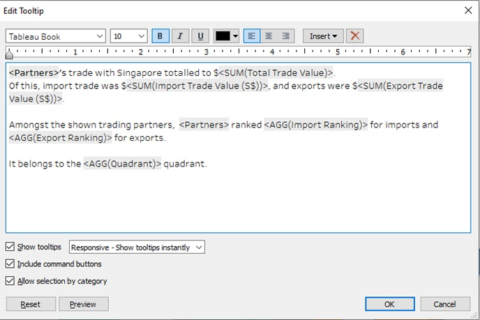
d.	Change label settings as in the image below

f.	Edit filter titles. In the right panel with the filter, click the triangle and edit title.

g.	Format > Add Animations to add animation to show the change of partner trade with time.


8.	Second Visual – Bar Chart
a.	Create Bar Chart to show specifics of each partners' trade data
b.	Select new worksheet tab within workbook.
c.	Label as Bar Chart
d.	Drag and drop Partners to Y-axis
e.	Drag and drop Import Trade Value to x-axis
f.	Drag and drop Export Trade Value to x-axis

g.	Right click Export Trade Value and Import Trade Value header, de-select show header 
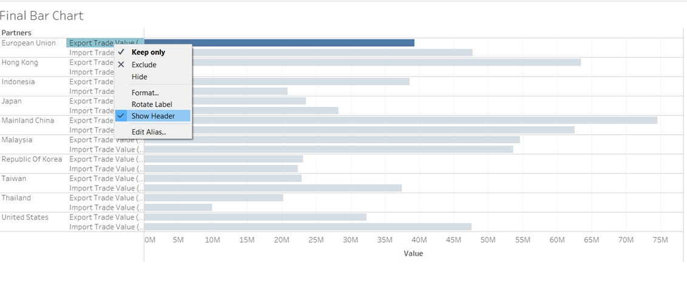
h.	Drag and drop measure names to Colour


i.	Within colour filter on right panel, click edit colours to arrive at this panel. Change the colour to blue and select two different shades (one dark and one light)

j.	Drag and drop Date to Filter, Select by Years, select all years
k.	Select show filter and apply to all using the data source

l.	Analysis > Create Calculated Field > Trade difference between (Import - Export) 
ABS([Import Trade Value (S$)]-[Export Trade Value (S$)])
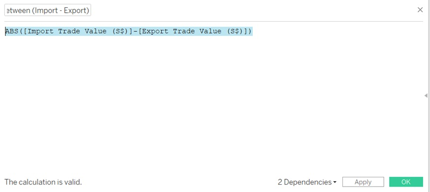

m. Edit Tooltip. Click tooltip and edit with the following:
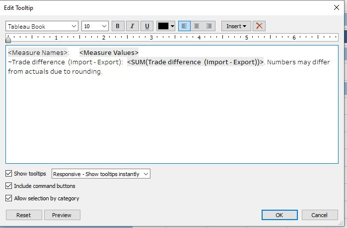

9.	Create Dashboard
a.	Create dashboard sheet
b.	Drag and drop charts
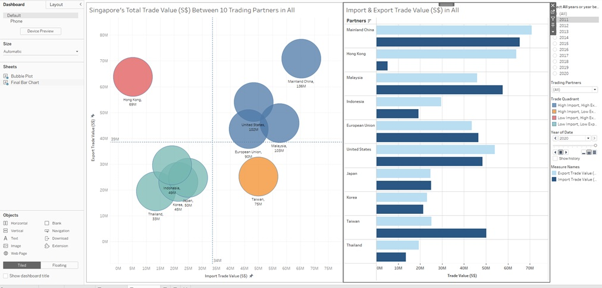
c.	Drag and drop text box and insert Title, comments and source
d.	Select text box and click layout out to format box colour

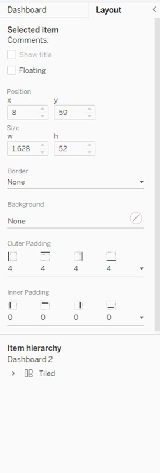


10.	Touch up charts to make dashboard look better
a.	Changed chart titles, labels, font size, colouring for each chart
b.	Within dashboard, moved the legend around to improve aesthetics 


c.	Added comments below title


### 5. Derived Insights 
-	Mainland China’s total trade with Singapore has overtaken trade with Malaysia over the years. In 2011, Singapore’s total trade with Malaysia was $113B, ranking it 2 for imports and 1 for exports. By 2020, Malaysia was ranked 2 for imports and 4 for exports with a total trade at $103B.
On the other hand, Mainland China was ranked at 4 for imports and exports in 2011 with a total trade of $102B. By 2020, it became Singapore’s largest trading partner ranked 1 for imports and exports with a total trade of $136B.

-	Singapore’s imports and exports to Hong Kong has the largest trade deficit across all years. Hong Kong has also remained as Singapore’s low import but high export market. In 2011, Hong Kong ranked 10 for imports and 3 for exports. In 2020, it ranked 10 for imports and 2 for exports. The difference in trade amount in 2011 was $57B, in 2020 it was $59B.
-	In 2011, Singapore had 3 high import, high export partners. Namely, Malaysia, Mainland China and European Union. On the end of the spectrum, it had 3 low export, low import partners. By 2020, this dynamics had changed. Singapore had 4 high export, high import partners, namely, Mainland China, Malaysia, European Union and United States. In addition, it had 4 partners with low import, low export trade, namely, Japan, Korea, Indonesia and Thailand.
-	Over the years, the animation highlights the growing total trade value between Singapore and the European Union and US, moving from a high import, low export relationship to a high import, high export relationship. While Indonesia has dropped from low import, high export to low import, low export.
-	In 2020, Singapore’s total trade with Mainland China at $136B is larger than its trade with Japan, Korea and Thailand combined at $128B. 
-	Singapore’s trade with Japan and Korea is approximately the same in 2020. Total trade with Korea and Japan is $45B and $50B respectively. The trade difference for Singapore and import and export to Korea and Japan is at $2B.


I hope you enjoy exploring the data. 
Do hover over the bubbles and bar chart to derive deeper insights. The filters are also useful for analysis!


