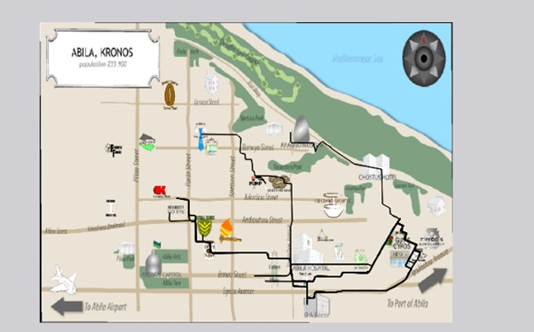
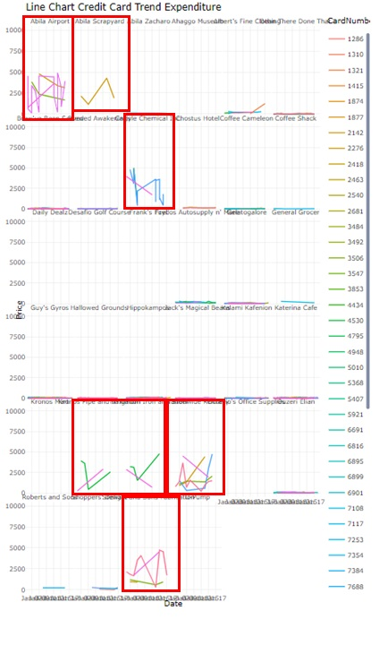
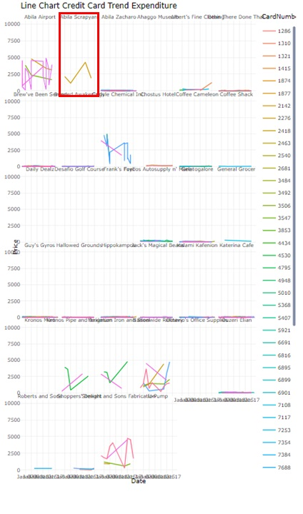

```{r setup, include=FALSE}
knitr::opts_chunk$set(echo = TRUE, eval = TRUE, message = FALSE, error = FALSE, fig.retina = 3)
```

### 1.Overview
This assignment is part of [VAST Challenge 2021 - Mini Challenge 2 ("MC 2")](https://vast-challenge.github.io/2021/MC2.html)
The challenge scenario is given as follows: 
  
“In January, 2014, the leaders of GAStech are celebrating their new-found fortune as a result of the initial public offering of their very successful company. In the midst of this celebration, several employees of GAStech go missing. An organization known as the Protectors of Kronos (POK) is suspected in the disappearance, but things may      not be what they seem.”
   
As part of Mini-Challenge 2, visual analytics was performed on i) employee movement using vehicle gps data; ii) credit card transactions; and iii) loyalty card usage data. From this, visual analysis identified anomalies and suspicious behaviours. This data will be used by the law-enforcement agents to get to the bottom of the case! 

The visual analysis aims to provide answers to the following questions posed by MC-2: -

-	Identify the most popular locations, and when they are popular. What anomalies do you see? What corrections would you recommend to correct these anomalies? 

-	What discrepancies between vehicle, credit, and loyalty card data do you find? 

-	Can you infer the owners of each credit card and loyalty card? What is your evidence? Where are there uncertainties in your method? Given the data sources provided, identify potential informal or unofficial relationships among GASTech personnel. 

-	Do you see evidence of suspicious activity? Identify 1- 10 locations where you believe the suspicious activity is occurring, and why.

The assignment report was written using R Markdown in Distill format. The report is published on Nelify. The data is available on [Github](https://github.com/Manmit1Singh/Project/tree/master/_posts/2021-07-16-third-time-a-charm).


### 2.Literature Review
The literature review looks at 3 approaches used  to solving MC-2 in 2014. Specifically, a review was done on the data visualisation approach and gaps were identified for i) alternative visual analytics could be used to enhance the user experience; and ii) identification of R packages that could be replicate useful visuals . 

a.	Entry - CSU-Zhao-MC2 , VAST Challenge 2014, Mini-Challenge 2


Figure 2.1: From Top Left: Combined Visualisation for Analysis, RadViz and Parallel Coordinates and Matrix Visualisation

[Zhao et. al.](https://www.cs.umd.edu/hcil/varepository/VAST%20Challenge%202014/challenges/MC2%20-%20Patterns%20of%20Life%20Analysis/entries/Central%20South%20University/) used D3, MYSQL and Excel to produce the visual for analytics. The team approached the challenge by i) segmenting car-tracking data and tracking start and end points using temporal colour coding on the map; ii) utilizing consumption data to locate precise positions; and iii) created a map by merging multiple layers – tourist map, with the road-network, location and legend layers. 

For visual analysis, the team used i) RadViz Tool; ii) PMViz Tool; and iii) SGGVIz Tool. The RadViz was used to cluster consumer places and employees with common consumptions habits. PMViz was used for Parallel Coordinates and Matrix Visualisation to identify when people were together, by time, place and fleshes out events that happened when running through a timeseries.  SGGViz was used to produce a Scatter view and Gantt Chart & GIS view. The visualisations were combined and cross-referenced with interactivity to explore and analyse the data.  

The visualisations used are diverse to understand behaviours. Specifically, RadViz with clustering identifies consumption habit trends of employees. While the Parallel Coordinates and Matrix identifies behaviours. The map traces activity and travel route. These visualisations flesh out the given data neatly. Lastly, the gantt chart helps place the visual in a time-series. Notably, to build the map, the team constructed used 4 layers (legend, location, road-network and tourist map). This was useful when mapping the gps data to get a sense of the routes taken and locations visited.

Reflecting on their approach, it would be useful to construct the tourist map with the various layers. A search done recommended using raster, sf and tmaps packages in R to accomplish this. For timeseries data, Gantt charts and the timetk package will be explored. Aside, instead of using Radviz in R, the visNetwork package could be useful to build nodes and edges to understand the connections between locations and credit card usage. visNetwork has interactivity for the user to explore underlying relationships. Another approach could be to use a correlation matrix to relate the employees to each other. 


b. Entry - Purdue-Guo-MC2 , VAST Challenge 2014, Mini-Challenge 2


Figure 2.1: Visual Analysis Interactive Visual

[Guo et. al.](https://www.cs.umd.edu/hcil/varepository/VAST%20Challenge%202014/challenges/MC2%20-%20Patterns%20of%20Life%20Analysis/entries/Purdue%20University/) used Dodeca-Rings Map together with a temporal chart and social relationship matrix. The team used HTML5, CSS, SVG, JavaScripts, jQuery, PHP, MySQL and D3 to query, compute, serve and visualize data. The visual is interactive and helps the user understand the activity in a time-series along with the relationships between the employees. The dodecagons flesh out the events on the map. All the visuals are inked for the user to differentiate events.


Figure 2.3: Tooltip for Dodecagons

The dodecagons also have a tooltip feature which goes into deeper details. However, a lot of detail is shown within a tool tip, it could have been more useful to showcase the details in another window below the dodeca-ring map for exploration. In addition, while the Dodeca rings are neater, for persons unfamiliar with Dodecans, it would be challenging to interpret.


Figure 2.4:Temporal Chart and Social Relationship Matrix

The temporal chart and social relationship matrix are useful to understand how persons related to one another and the car travel in a timeseries. There are also options to filter the within the temporal chart that makes the interaction easy and allow the user to dig deeper.

The inking used by the team is particularly attractive and easy to interpret and visualize data. Similar to Guo et. al. in (a), a time-series was used along with mapping of gps data on the map. Instead of using Radviz, the team used a correlation matrix. Reflecting on how the correlation matrix looks, it could be more useful to leverage a network graph instead. That could be more visually useful to spot clusters and relationships between people and locations. Furthermore, the interactive provides additional investigation of the data. Aside, detail to understand movement on the map is useful. In R, a possibility could be to use data tables that allow filtering of data. In addition, using the crosstalk package would link charts to the data tables.


c. Entry - FIAIS-Andrienko-MC2 , VAST Challenge 2014, Mini-Challenge 2
[FIAIS-Andrienko et. al. ](https://www.cs.umd.edu/hcil/varepository/VAST%20Challenge%202014/challenges/MC2%20-%20Patterns%20of%20Life%20Analysis/entries/Fraunhofer%20IAIS%20and%20City%20University%20London/) used V-Analytics to develop the visual. The motivation for their visual seems to be on leveraging queries to explore the date.  


Figure 2.5: Query Done on Visual

While this is great for exploration, it is not very beneficial when the user shows this to the rest of the investigation team as the data is not forthcoming and the team will have to continuously explore. This is good for deep investigation, but, not as beneficial for visual analytics to identify underlying trends given the continuous need to query. A good mix would be i) a visualisation that already fleshes out certain abnormalities; and ii) has exploration functions for each visual for the user to explore second-level details. Users unfamiliar with V-analytics may be overwhelmed by the options and the many legends and visuals used. For example, the screen shot below of geospartial data has a lot of going on and is not guided enough for the user to follow. As a recommendation, the map layout could be used given that it is intuitive to many, along with filter options for the vehicles or persons driving. 


Figure 2.6: Using Geospartial Data

Lastly, the tabular representation of data is not a good idea when using visualisation as users will find it difficult to read across columns and rows. The colours are useful but it can be better represented using a temporal chart or Gant chart.


Figure 2.7: Data Visualisation Using a Table

To bridge the visual analytics gap, it could be useful to use the tmaps in R to plot individual routes taken and understand each user’s travel patterns. In addition, crosstalk could be used to link visuals to tables, vis-à-vis creating a query function. It would be useful for the data tables using crosstalk to have a filter function.


d. Takeaways
Key takeways from the above review include:-

-	Visualisation used should be intuitive for the user to explore;

-	Interactivity, data tables and tooltops are essential to explore second level details and must be used while remaining neat;

-	To understand the data, leverage various charts (e.g use Gantt chart for time-series, and tmaps for gps data). Aside from interactivity, link the charts together to gather deeper insights.

-	Tell the story and do not convolute the charts with too many details and query options;

-	Consider using network visualisations to identify relationships;    

- Inking will be essential to spotting trends given the number of data points.


### 3.	Approach and Packages 
In this assignment, both static and interactive visuals were created to explore and derive insights from the data. Specifically, bar charts, box-plots, heatmaps, visual mapping and network visuals were used.

The following packages were installed for the assignment: - 

-	Igraph - For creating and manipulating graphs and analysing network

-	visNetwork - visNetwork is an R package for network visualization

-	lubridate - To work with dates and times

-	DT - R data objects (matrices or data frames) can be displayed as tables on HTML pages, and DataTables provides filtering, pagination, sorting, and many other features in the tables

-	Ggiraph - A htmlwidget and a ggplot2 extension. It allows ggplot graphics to be animated

-	Plotly - Package for creating interactive web-based graph

-	tidyverse - An opinionated collection of R packages designed for data science. All packages share an underlying design philosophy, grammar, and data structures

-	Raster - Reading, writing, manipulating, analyzing and modeling of spatial data. The package implements basic and high-level functions for raster data and for vector data operations such as intersections

-	sf  - Support for simple features, a standardized way to encode spatial vector data. Binds to 'GDAL' for reading and writing data, to 'GEOS' for geometrical operations, and to 'PROJ' for projection conversions and datum transformations

-	tmap -  tmap package is a brand new easy way to plot thematic maps in R

- clock - For working with date-times. It is packed with features, including utilities for: parsing, formatting, arithmetic, rounding, and extraction/updating of individual components

-	Rgdal - Bindings for the 'Geospatial' Data Abstraction Library

-	Dplyr - Provides a set of tools for efficiently manipulating datasets in R

-	Sugrrants - Supporting graphs for analysing time series. Description. Provides 'ggplot2' graphics for analysing time series data. It aims to fit into the 'tidyverse' and grammar of graphics framework for handling temporal data

-	Hms - Provides a simple class for storing durations or time-of-day values and displaying them in the hh:mm:ss format

-	Crosstalk – Enhances the htmlwidgets package. It extends htmlwidgets with a set of classes, functions, and conventions for implementing cross-widget interactions (currently, linked brushing and filtering)

-	timetk - Consolidates and extends time series functionality from packages including 'dplyr', 'stats', 'xts', 'forecast', 'slider', 'padr', 'recipes', and 'rsample'

-	tidygraph - A huge package that exports 280 different functions and methods. It more or less wraps the full functionality of igraph in a tidy API giving you access to almost all of the dplyr verbs plus a few more, developed for use with relational data

-	Ggraph - An extension of the ggplot2 API tailored to graph visualizations and provides the same flexible approach to building up plots layer by layer

-	Ggrepel - Implements functions to repel overlapping text labels away from each other and away from the data points that they label

-	Htmltools – Makes it easy to customize the user interface (UI) of any Shiny or R Markdown project by using R code to generate custom HTML (including JavaScript and CSS).

The data sets will be tackled individually to identify trends, suspicious and erratic behavior, and discover relationships. Thereafter, visualisations will be pieced together to address MC-2 questions.


### 4. Data Preparation 

a. Install and Load Packages 
The following is done in RStudio using Rmarkdown.


```{r}
#Install and Launch R Packages

packages = c('igraph','visNetwork','lubridate', 'DT', 'ggiraph', 'plotly', 'tidyverse', 'raster', 'sf', 'tmap', 'clock', 'rgdal','dplyr', 
             'hms', 'crosstalk','timetk', 'tidygraph', 'ggraph', 'ggrepel', 'htmltools', 'sugrrants')

library(ggplot2)


for (p in packages){
if (!require(p, character.only = T)){
  install.packages(p)
  }
  library(p, character.only = T)
}
```

b. Importing Data

The files provided (car-assignements, cc_data, loyalty_data and gps) are imported.Two other files were created in excel for data exploration to understand if it was a useful format to have the data in for creating visuals. These files are All_Combined2 and All_Combined3. Specifically, All_Combined2 merges cc and loyalty card data in the following format "Loyalty Date, LoyaltyLocation, Loyalty Price, LoyaltyNumber, CreditCardTimerstamp, Location, CreditCardPrice, CardNumber, CreditCardDate. All_Combined4 merges the cc_data and loyalty_card data in the following table form “Date, Location, Price, CC.Loyalty, CC.Loyalty.Type".

```{r}
#Importing car-assignment data
car_assign<- read_csv("data/car-assignments.csv")
credit_card<- read_csv("data/cc_data.csv")
gps <- read_csv("data/gps.csv")
loyalty <- read_csv("data/loyalty_data.csv")
#combined_trans <-read_csv("data/All_Combined2.csv")
combined_trans_pivot <- read_csv("data/All_Combined4.csv")
``` 

c. Data Cleaning

The steps below flesh out the data cleaning process.  
For each data set, glimpse("data set name") was used to identify the format of the data.Thereafter, the following was performed :- 

-	For columns that contain numbers that are categorical (for example, car id, credit card number and loyalty number), as_factor is used to convert them to factor <fct>

-	Columns that contain timestamp, date and time are converted to <dttm> data type

-	Columns that contain characters are checked to be in <chr> and columns with continuous types are checked to be in <dbl>

-	Empty rows are checked 

The cleaned data sets are fleshed below the code chunk.

```{r}
#Clean Data

#1. For Car_Assign, Truck Drivers have no Car Id. Change 'NA' to '0' and CarID used as_factor
car_assign[is.na(car_assign)] = 0
car_assign$CarID <- as_factor(car_assign$CarID)
car_assign_clean <- car_assign


#2. Credit Card Timestamp data needs to be in the proper attribute
credit_card$timestamp <- date_time_parse(credit_card$timestamp,
                                 zone = "",
                                 format = "%m/%d/%Y %H:%M")
credit_card$last4ccnum <- as_factor(credit_card$last4ccnum)
credit_card_clean <- credit_card #save data set as credit_card_clean

#The credit card timestamp data can be further split 
credit_card_split <- credit_card_clean %>%
  mutate(year = format(timestamp,"%m/%d/%Y"),
         time = format(timestamp,"%H:%M:%S"))
credit_card_split$year <- date_parse(credit_card_split$year,
                                format = "%m/%d/%Y")
credit_card_split$time <- as.hms(credit_card_split$time)

#3. GPS Timestamp needs to be in the proper attribute
gps$Timestamp <- date_time_parse(gps$Timestamp,
                                 zone = "",
                                 format = "%m/%d/%Y %H:%M:%S")
gps$id <- as_factor(gps$id) #id should be a factor and not continuous numerical format
gps_clean <- gps #save data set as gps_clean

#4. Loyalty Card Data - timestamp needs to be in the proper attribute and loyalty number as factor
loyalty$timestamp <- date_parse(loyalty$timestamp,
                                format = "%m/%d/%Y")
loyalty$loyaltynum <- as_factor(loyalty$loyaltynum)
loyalty_clean <- loyalty #save data set as loyalty_clean

#4. For exploration - combined loyalty and credit card data.
#Sort of the date and time formats
#combined_trans$LoyaltyDate <- date_parse(combined_trans$LoyaltyDate,
#                                         format = "%m/%d/%Y")
#combined_trans$CreditCardDate <- date_parse(combined_trans$CreditCardDate,
#                                         format = "%m/%d/%Y")
#combined_trans$CreditCardTimestamp <- date_time_parse(combined_trans$CreditCardTimestamp,
#                                 zone = "",
 #                                format = "%m/%d/%Y %H:%M")

#Identifiers should be in fct format
#combined_trans$LoyaltyNumber <- as_factor(combined_trans$LoyaltyNumber)
#combined_trans$CardNumber<- as_factor(combined_trans$CardNumber)
#combined_trans$LoyaltyNumber<- as_factor(combined_trans$LoyaltyNumber)


#5. Pivoted data
combined_trans_pivot$Date <- date_parse(combined_trans_pivot$Date,
                                         format = "%m/%d/%Y")
combined_trans_pivot$CC.Loyalty <- as_factor(combined_trans_pivot$CC.Loyalty)
combined_trans_pivot$Location <- as_factor(combined_trans_pivot$Location)


# 6. Looking at the cleaned data sets
glimpse(loyalty_clean)
glimpse(credit_card_clean)
glimpse(gps_clean)
#glimpse(combined_trans)
glimpse(combined_trans_pivot)
```


d. Merging Data sets
The cc and loyalty data was merged and imported earlier. As such, it will not be done in R. However, R is capable of doing this by using a right join and pivoting the data table. Please refer to this [link](https://tidyr.tidyverse.org/articles/pivot.html)for more information.

Next, given that CarID is tagged to employee name, GPS data is merged with Car Assignment data as follows:

```{r}
#Merge GPS with car assignment. Merge on CarId

Employee_travel <- merge(gps_clean, car_assign_clean, by.x="id", by.y="CarID")
names(Employee_travel)[names(Employee_travel) == "id"] <- "CarID"
Employee_travel$NameTitle <- paste(Employee_travel$Name, Employee_travel$CurrentEmploymentTitle)
glimpse(Employee_travel)
```

###ime to get a sense of what was happening!!!

### 5. Exploring Credit Card data

a. Popular Places by Credit Card ("cc") Data

Using credit card usage count and location, a bar chart is plotted to identify locations where credit cards were more frequently used.

```{r fig.width=12, fig.height=8}
#This is the start of data exploration
#Exploring the Credit Card Data

#1. Most Popular Places - barchart

credit_card_clean %>%
  mutate(location = fct_infreq(location)) %>%
  ggplot(aes(x = location)) +
  geom_bar()+
  xlab("Location") +
  ylab("Visits Count") +
  theme(axis.text.x = element_text(vjust = 0.5, hjust=1))+
  labs(title = "Most frequented places according to credit card data")+
  coord_flip()

```


Katerina Cafe, Hippokampos, Brew’ve Been Served and Guy’s Gyros were most frequented by the employees according to  credit card usage. Katerina Cafe, Brew’ve Been Served and Guy’s Gyros are likely F&B outlets, but it is unclear at this juncture what Hippokampos is. Given that Kronos Kares benefit card is given to GASTech employees giving them discounts and rewards, we could expect loyalty card data to show a similar trend in visits. Aside, Daily Dealz, U-Pump, and Frank’s Fuel are places where credit cards were least used and assumed least frequented at this juncture.


b. Most Used Credit Cards
Plotting the credit card number (last 4 numbers) by count, we examine the most used credit cards. 

```{r fig.width=12, fig.height=8}
#2. Most Used Credit Cards 
credit_card_clean %>%
  mutate(last4ccnum = fct_infreq(last4ccnum)) %>%
  ggplot(aes(x = last4ccnum)) +
  geom_bar()+
  xlab("Last 4 digits of Credit Card") +
  ylab("Useage Count") +
  theme(axis.text.x = element_text(vjust = 0.5, hjust=1))+
  labs(title = "Credit cards that were most used")+
  coord_flip()
```


The bar chart highlights cc ending with 6901, 8332 and 3484 as the most used. While 9614, 9152, and 5010 were the least used. The difference between the most and least used credit cards is ~3x. 


c. Outliers in Credit Card Use by Spend and Location 
Outliers could highlight unusual credit card spend. The price (y axis) is plotted against the cc numbers (x axis). To get a sense of each location’s outliers, the boxplots are faceted by location.

```{r fig.width=30, fig.height=50}
#3 Outliers for Credit Card expenditure

#static check
check_outlierS <- credit_card_clean %>%
    ggplot(aes(x=last4ccnum, y=price)) +
    geom_boxplot() +
    facet_wrap(~location, ncol = 5, scales = "free") +
    theme_minimal() +
    theme(panel.border = element_rect(colour="grey60", fill = NA),
          axis.text.x.bottom = element_blank())
check_outlierS
```

Some interesting information is beginning to show! 

- The Airport was visited by 5 different persons making multiple purchases over two weeks, spending largely between $1000 - $5000. 

-	It looks like only 1 credit card was used at Abila Scrapyard. What could someone be buying from a Scrapyard? It seems that the employee went to the scrapyard a few times spending between $1000 - $2000 - some priceless scraps?

-	At Albert’s Fine Clothing, one cc spent between $100 - $1250 within a span of two weeks. Curious what the employee bought within a short time span. 

-	Chostus Hotel had only 3 cc used that spent between $100 - $600. This is interesting given wide cost range and short time span it was spent over. Were they together, was it dinner or a staycay? 

-	Hippokampos is starting to look like a F&B outlet. Comparing the spending patterns to Katerina Cafe and Brew’ve Have Been Served. It seems like a frequented place for employees, spending up to ~$150.

-	Frydos Autosupply n More has a major outlier with a cc spend of $10000. This is almost 10x more than the rest.


The outliers can be further explored using ggplotly wrapper that give the boxplots interactivity.

```{r fig.width=30, fig.height=50}
#dynamic check
check_outlierS <- credit_card_split %>%
    ggplot(aes(x=last4ccnum, y=price)) +
    geom_boxplot() +
    geom_point(position="jitter",size = 0.5)+
  facet_wrap(~location, ncol = 2, scales = "free")
  
ggplotly(check_outlierS)
```


d. Understanding the spending patterns

A heatmap of the expenditure is plotted along with a datable. The heatmap plots cc number (day) against location, coloured with price. This provides a quick visual of the outlier prices by cc number and place. Alongside, a data table is plotted to gather second level details. 

```{r fig.width=20, fig.height=12}
#4. HeatMap of Expenditure of Credit Card Holder at Various Locations
p_hm2 <- plot_ly(data=credit_card_split,
        x= ~last4ccnum,
        y= ~location,
        color=~price) %>%
  layout(title = 'Heatmap of expenditure of credit card holder at various locations')
p_hm2

DT::datatable(credit_card_split,
              filter = 'top') %>%
  formatStyle(0,
              target = 'row',
              lineHeight = '60%')
```


From the visual above, the following cc numbers were investigated.

- 9152


Travelling from the refinery to Stewart and Sons Fabrication once a week. The employee has interesting expenditure patterns, spending $4513 at the refinery and then $1738 at Stewart and Son’s. The person then spends $1903 and $4545 at the Refinery and Stewart’s respectively the next week. The expenditure only occurs in the morning and the employee does not spend anywhere else within Kronos.

- 7792


Employee logged expenditure in the ‘000s at the Carlyle Chemical, sometimes on the same day, other times in consecutive days. The employee also spends ‘000s at the refinery. His expenditure at the Refinery is usually between 11 – 12pm. At Carlyle Chemical, he spends at least once in the morning between 930 to 10. The expenditures in the afternoon vary between 2 – 5pm. Lastly, he goes to the Katerina’s before going to Carlyle’s.


-	6816


Spends regularly at the cafes. The employee seems to eat out a lot, being at places like Katerina’s, Guy’s and Brew’ve Been Served during breakfast, lunch and dinner timings. From this we can derive that Ouzeri Eilan could be a F&B outlet as well. 


-	8332 


Spent $150 at the Kronos mart at 3:48am. This is a strange time to spend that much at a mart.


Filtering data table for the suspicious locations identified earlier


-	Airport 


 

8642 went to the airport between the 6th -9th and 13th – 16th, spending twice each day between 12-1pm and 3-5pm.

-	Abila Scrapyard


Abila scrapyard was visited by 2276 on both weeks on Tuesday and Thursday, all times were in the afternoon by cc holder 2276. Zooming into 2276's expenditure:


There is trend of places visited. The card holder starts spending on Tuesdays and Thursday by going to the Airport -> Scrapyard -> Stewart and Sons -> Refinery. Ooo I wonder what could be going on here!

- At Albert’s Fine Clothing
 

Another contentious location. Spending at this place by employees mainly happens after 8pm! Notably, there are some employees who spend during the afternoon. 


- Chostus Hotel 


Two employees with cc numbers 2540 and 9683 spend almost within half an hour to each other. An oulier – 5010- spend on 18th Jan at 12pm, a day after 9683 and 2540. 


- Frydos Autosupply n More 


Majority of the cc spent were after 7pm, some as late as 920pm. Notable some spent at 3pm


e. Overall view of spending trends 
Using a Gantt chart, by plotting Location (y-axis) against timestamp(x-axis), overall patterns of spending by time are noticed. 

```{r fig.width=20, fig.height=12}
#6. Credit Card Amount spent at Location 
ts_hm_cc2 <- credit_card_split %>%
 filter(timestamp >= "2014-01-05 15:28:00" & timestamp <= "2014-01-19 04:51:00") %>%
 ggplot() +
  aes(
    x = timestamp,
    y = location,
    fill = price,
    colour = price,
    tooltip = last4ccnum
  ) +
  geom_tile(size = 1.2) +
  scale_fill_distiller(palette = "Set1", direction = 1) +
  scale_color_distiller(palette = "Set1", direction = 1) +
  labs(
    x = "Timestamp",
    y = "Location",
    title = "Heatmap - Amount spend at location"
  ) +
  theme_minimal()


ggplotly(ts_hm_cc2)


DT::datatable(credit_card_split ,
              filter = 'top') %>%
  formatStyle(0,
              target = 'row',
              lineHeight = '60%')

```

- Nationwide Refinery: Spending patter seems to have a rhythm. In the first week, the time gaps seems consistent with larger spends. In the second week, we spot a similar rhythm, albeit with smaller spends.

-	Abila Airport: There is a spending pattern and rhythm. It starts off with a small amount expenditure and increases over the week. The following week, the same rhythm pattern repeats.

-Stewart and Sons Fabrication: Consistent spending over the first week with larger amounts, but spend value tapers off during the second week.

- Hippokampos and Hallowed Grounds: These F&B establishments show higher amounts of expenditure at their premises during the first week, but this is not repeated over the second week. The missing pattern makes me suspicious!


f. Spending patterns by each cc owner by location

Here we explore how the credit card is spending at each location. Is the cc card owner consistent in spending or are there peaks and troughs? Plot price (y-axis) by credit card date(x-axis) in a line graph and facet with location. 

```{r fig.width=20, fig.height=12}
#6.1
ts_hm_cc3 <- credit_card_split %>%
 filter(timestamp >= "2014-01-05 15:28:00" & timestamp <= "2014-01-19 04:51:00") %>%
 ggplot() +
  aes(x = year, y = price, colour = last4ccnum) +
  geom_line(size = 0.5) +
  scale_color_hue(direction = 1) +
  labs(
    x = "Date",
    y = "Price",
    title = "Line Chart Credit Card Trend Expenditure"
  ) +
  theme_minimal() +
  facet_wrap(vars(location))

ggplotly(ts_hm_cc3)

DT::datatable(credit_card_split,
              filter = 'top') %>%
  formatStyle(0,
              target = 'row',
              lineHeight = '60%')
```


-	4530 spend pattern Kronos Pipe and Irrigation and Maximum Iron: The card owner has the same spending pattern across the two, starting high on the 7th, before dipping low on the 9th and increasing on the 15th.

-	8642 at Abila: The card owner exhibits at ‘W’ spending patterns at a F&B outlet. Spending twice a day at the outlet.

-	9614 decreases spending at Nationwide Refinery, while 2276, 7792, 3506 and 9735 gradually increase their spend.

-	Abila Scrapyard 2276: Spends High – Low- High Low.

-	Carlyle Chemical: Erratic spending behavior by 7792.

Putting the spend behaviours together, some erratic card behaviour is observed. The detailed observations have been stated.  

```{r fig.width=20, fig.height=12}
#6.2

ts_hm_cc4 <- credit_card_split %>%
 filter(timestamp >= "2014-01-05 15:28:00" & timestamp <= "2014-01-19 04:51:00") %>%
 ggplot() +
  aes(x = year, y = price, colour = location) +
  geom_line(size = 0.5) +
  scale_color_hue(direction = 1) +
  labs(
    x = "Date",
    y = "Price",
    title = "By Location - Credit Card Trend Expenditure"
  ) +
  theme_minimal()

ggplotly(ts_hm_cc4)

```

To find out more about the relationships, the following chart can be explored.

```{r fig.width=20, fig.height=12}

#6.3

ts_hm_cc5 <- credit_card_split %>%
 filter(timestamp >= "2014-01-05 15:28:00" & timestamp <= "2014-01-19 04:51:00") %>%
 ggplot() +
  aes(x = year, y = last4ccnum, fill = location) +
  geom_tile(size = 1.2) +
  scale_fill_hue(direction = 1) +
  labs(
    x = "Day",
    y = "Credit Card Number",
    title = "Credit Card Number by Location and Day"
  ) +
  theme_minimal()
ggplotly(ts_hm_cc5)
```


### 6. Time to get a sense of Loyalty Card Data!

a. Most Frequented placed according to loyalty data
Plotting a bar chart with location against visits count. 

```{r fig.width=12, fig.height=8}
#Exploring Loyalty Data

#7. Most Popular Places - barchart

loyalty_clean %>%
  mutate(location = fct_infreq(location)) %>%
  ggplot(aes(x = location)) +
  geom_bar()+
  xlab("Location") +
  ylab("Visits Count") +
  theme(axis.text.x = element_text(vjust = 0.5, hjust=1))+
  labs(title = "Most frequented places according to loyalty data")+
  coord_flip()
```

The bar chart shows that Katerina Cafe, Hippokampos, Guy’s Gyros were the top 3 places where the loyalty card was used. This is similar to the credit card data. However, the number of times used is different. The least frequented places are U-pump, Frank’s Fuel and Octavo’s Office Supplies. This differs slightly from the credit card data, where Daily Dealz was one of the places with the lowest credit card usage. Noticeably, Daily Dealz was not a location where the loyalty count was used.


b. Most Active Users of the Loyalty Card

The usage count is plotted against the loyalty number in a bar chart to understand which card uses were the most active.

```{r fig.width=12, fig.height=8}
#8. Most Used Loyalty Cards
loyalty_clean %>%
  mutate(loyaltynum = fct_infreq(loyaltynum )) %>%
  ggplot(aes(x = loyaltynum )) +
  geom_bar()+
  xlab("Loyalty Number") +
  ylab("Useage Count") +
  theme(axis.text.x = element_text(vjust = 0.5, hjust=1))+
  labs(title = "Loyalty cards that were most used")+
  coord_flip()

```

The most active loyalty cards were L6267, L2490, L2070, and L3366. The least active were L5924, L5485, L2459, and L8477.


c. Outliers for Loyalty Cards

Plotting a boxplot with loyaltynum against price, faceted by location gives an indication of outlier data points. From here, we can understand if patterns are similar for both credit card and loyalty cards. In addition, for glaring expenditures, it would be possible to identify a cc match with loyalty card.


```{r fig.width=30, fig.height=50}
#9 Outliers for Loyalty expenditure

#static check
check_outliers__lylty <- loyalty_clean %>%
    ggplot(aes(x=loyaltynum, y=price)) +
    geom_boxplot() +
    facet_wrap(~location, ncol = 5, scales = "free") +
    theme_minimal() +
    theme(panel.border = element_rect(colour="grey60", fill = NA),
          axis.text.x.bottom = element_blank())
check_outliers__lylty
```


The trends point to the loyalty card being used by employees at F&B outlets such as Guy’s Gyros and Katerina’s cafe. Outliers reflect a similar trend seen in the usage of credit card data. On that note, for glaring outliers such as the spend at Abila Scrapyard, where only one person spent on particular days, we can connect the dots that a particular loyalty card was used by the credit card holder. We can assume this with some level of confidence. For more popular locations, it would be more challenging to match the data based on price and day to connect the credit card number to loyalty card as loyalty cards could change hands when groups of people visit, for certain individuals to benefit from loyalty card usage. This will be investigated further.


d.Using the heatmap to identify loyalty card holder patterns by location and price
Similar to the credit card heatmap, loyaltynum is plotted against location.

```{r fig.width=20, fig.height=12}
#10. HeatMap of Expenditure of Loyalty Holder at Various Locations
p_hm_loyal <- plot_ly(data=loyalty_clean,
        x= ~loyaltynum,
        y= ~location,
        color=~price) %>%
  layout(title = 'Heatmap of expenditure of loyalty card holder at various locations')
  
p_hm_loyal

DT::datatable(loyalty_clean,
              filter = 'top') %>%
  formatStyle(0,
              target = 'row',
              lineHeight = '60%')
```

Some interesting points to note!

- L2769

Loyalty Card Data table:


Credit Card Data table: 


The card holder went to the Airport. Observing the data tables, the patterns are similar to the credit card spending patterns. The card recorded visits to airport between the 6th - 9th and 13th – 16th, spending twice each day at times. However, upon closer inspection, when comparing the loyalty and credit card data tables, the amounts are not similar. Comparing the dates and amount spent, it is noted that the amount is not the same. On 6th Jan, the credit spend was $612.47 for loyalty cards but $1873 for the credit card. 


- L5756

This loyalty card holder has a pattern of travelling from Carlyle Chemical to Katerina Cafe to Nationwide Refinery within a day and the pattern repeats! 


- L4063


This loyalty card number was picked out reflecting on the contentious activity at the airport. Investigating this number shows that the loyalty card has been to places that were highlight as contentious and perhaps where suspicious behaviour took place. This includes Carlyle Chemical, Abila Airport, Kronos Pipe and Irrigation and Maxi Iron and Steel. We will keep an eye on you L4063!


- Carlyle Chemical

Loyalty Card data


Comparing this to the credit car card: 

The data tables highlight the credit card expenditure. It is observed that given the price, cc 9220 seems to own L4063. cc 7792 linked to L5756, cc4530 linked to L8477. However, 7792 spent $4803 on 7th afternoon but did not use the loyalty card. We are suspicious of this!


e. Spending patterns 

Plotting y= price, x = timestamp, filled with price, line charts can be used to identify peaks and troughs in expenditure with loyalty cards. Lets see what we find! 

```{r fig.width=20, fig.height=12}
#12.1
ts_hm_loyalty3 <-ggplot(loyalty_clean) +
  aes(
    x = timestamp,
    y = price,
    fill = loyaltynum,
    colour = loyaltynum
  ) +
  geom_line(size = 0.5) +
  scale_fill_hue(direction = 1) +
  scale_color_hue(direction = 1) +
  labs(
    x = "Date",
    y = "Price",
    title = "Loyalty Card Spending Patterns by Location and Loyalty"
  ) +
  theme_minimal() +
  facet_wrap(vars(location))

ggplotly(ts_hm_loyalty3)

```

-	Abila Airport: Loyalty Card number L4063 exhibits the W spending as seen with credit cards. L3317 peaks spending together with L4063 before dropping. L7761’s spending drops over time, almost a mirror image of L3317. The latter two patterns were not as distinct with credit card expenditure. 

-	Frydos Autosupply: L5756 exhibits erratic behaviour, similar to the credit card visuals. 

-	Kronos Pipe and Irrigation and Maximum Iron and Steel: Similar spending patterns to credit card data.

-	Stewart and Sons Fabrication – Only 3 trend lines were spotted for cc data. For loyalty data, there are four trend lines. L2276 is the additional line that does not reflect a trend. This needs to be investigated further.


Further trends can be explored using the following:

```{r fig.width=20, fig.height=12}
#12.2
ts_hm_loyalty4 <- ggplot(loyalty_clean) +
  aes(x = timestamp, y = location, fill = loyaltynum) +
  geom_tile(size = 1.2) +
  scale_fill_hue(direction = 1) +
  labs(
    x = "Date",
    y = "Location",
    title = "Loyalty Number by Date by Location"
  ) +
  theme_minimal()

ggplotly(ts_hm_loyalty4)

```

```{r fig.width=20, fig.height=12}

#12.3
ts_hm_loyalty5 <- ggplot(loyalty_clean) +
  aes(x = timestamp, y = loyaltynum, fill = location) +
  geom_tile(size = 1.2) +
  scale_fill_hue(direction = 1) +
  labs(
    x = "Date",
    y = "Loyalty Card Number",
    title = "Loyalty Card Number by Date"
  ) +
  theme_minimal()

ggplotly(ts_hm_loyalty5)

```

```{r fig.width=20, fig.height=12}
#12.4
ts_hm_loyalty6 <- ggplot(loyalty_clean) +
  aes(x = timestamp, y = price, colour = location) +
  geom_line(size = 0.5) +
  scale_color_hue(direction = 1) +
  labs(
    x = "Date",
    y = "Price",
    title = "Loyalty Card Usage by Date"
  ) +
  theme_minimal()


ggplotly(ts_hm_loyalty6)
```


By way of exploration, the following code chunk was used to plot the linear r/s between the credit card and loyalty card spend. However, to answer the question posted, another code chuck will be used in section 9.

```{r fig.width=20, fig.height=12}

#13 Investigate Linear R/s between Credit Card and Loyalty Card data
combined_trans_pivot1 <- combined_trans_pivot %>% 
  group_by(Location) %>%
  group_by(Date) %>%
  group_by(CC.Loyalty)

combined_trans_pivot1

combined_trans_pivot2 <- combined_trans_pivot1 %>%
  count(Date, Location, Price,CC.Loyalty, sort = TRUE)

combined_trans_pivot2

p_cc_loyal <- ggplot(combined_trans_pivot2) +
  aes(
    x = Date,
    y = Price,
    colour = CC.Loyalty,
    group = CC.Loyalty
  ) +
  labs(
    x = "Date",
    y = "Price",
    title = "Exploration of Loyalty Card to Credit Card Match"
  ) +
  geom_line(size = 0.5) +
  scale_color_hue(direction = 1) +
  theme_minimal() +
  facet_wrap(vars(Location))

ggplotly(p_cc_loyal)

```


From the above exploration, it is possible to zoom in on the locations and use visual analysis to spot that not all credit cards and loyalty amount match. Using this, it is possible to infer to some extent the credit card owners and loyalty card. Furthermore, it is possible to use the gps data and nodes to determine the owners. For example, from the gps and node data, it appears that Linnea Bergen and Orhan Strum visited the hotel. On that note, they could owners of 2540 and 9683 respectively. It cannot be 5010 because 5010 went to the golf course.


### 7. Exploring travel patterns using GPS Data

For this, it is important to note that the vehicles are tracked periodically as long as they are moving. On that note, the gps available shows when the employees are on the move.  Let us see who has been where! 


a. Movement of employees
Using a grant chart, we plot the employees name concatenated with title along the timestamp (x-axis). This will flesh out travel patterns over the two weeks.


```{r fig.width=20, fig.height=12}
#15 Looking at Movement Data

Employee_travel %>%
 filter(Timestamp >= "2014-01-05 14:28:01" & Timestamp <= "2014-01-19 04:56:55") %>%
 ggplot() +
  aes(x = Timestamp, y = NameTitle, colour = CurrentEmploymentType) +
  geom_tile(size = 1.2) +
  scale_color_hue(direction = 1) +
  labs(
    x = "Timestamp",
    y = "Name",
    title = "Movement of Employees"
  ) +
  theme_linedraw()
```


From this, some patterns are highlighted and discussed:


1.	Sten/President and CEO was away for a long period and only started being tracked after January 13.

2.	Nils/ IT Helpdesk, Loreto/ Site Control and Isia/Perimeter Control travelled at an odd timing given that the rest of the employees did not do this. This should be investigated further for time of travel and locations.

3.	Birgitta/Geologist and Minke/Perimeter Control have a similar gap in their travel patterns.

4.	Kare Orilla/ Drill Technician, Hideki/Site Control, and Brand/ Drill Technician have unusual large gaps before the day of the disappearance. These patterns are exhibited earlier.


b. Investigating Time lag 

The following code chunk is used to understand the time difference between the travel times. Setting it at 10mins gives an indication if the vehicle stopped and visited a location. While the location names are not tagged, by plotting the employees against time and using the time lag, their behaviour patterns can be understood and investigated further.


```{r fig.width=20, fig.height=12}
#16 Lets use lag method to investigate

gps_diff <- gps %>%
  arrange(id, Timestamp, lat, long) %>%
  group_by(id) %>%
  mutate(diff = Timestamp - lag(Timestamp),
         diff_mins = (as.numeric(diff, units = 'secs'))/60) %>%
  filter(diff_mins > 10)


Employee_travel2 <- merge(gps_diff, car_assign_clean, by.x="id", by.y="CarID")
names(Employee_travel2)[names(Employee_travel2) == "id"] <- "CarID"
glimpse(Employee_travel2)


Employee_travel2$NameTitle <- paste(Employee_travel2$Name, Employee_travel2$CurrentEmploymentTitle)


time_lag_plot <- Employee_travel2 %>%
 filter(Timestamp >= "2014-01-05 14:53:01" & Timestamp <= "2014-01-19 04:56:01") %>%
 ggplot() +
  aes(x = Timestamp, y = NameTitle, fill= diff_mins, colour = diff_mins) +
  geom_tile(size = 1.2) +
  scale_fill_distiller(palette = "Set1", direction = 1) +
  scale_color_distiller(palette = "Set1", direction = 1) +
  labs(
    x = "Timestamp",
    y = "Employee Name and Title",
    title = "Time Lag - Difference of > 10mins using GPS data"
  ) +
  theme_minimal()


ggplotly(time_lag_plot)

```


The image below highlights some time lags that do not conform to the majority of the employees movements.


Some time lag patterns were spotted across the following employees.

(1)	Alda SVP/CIO, Felix/Engineer and Israde/ Drill Technician and Elsa/Drill Technician.

(2)	Isla/ Perimeter Control and Israde/ Drill Technican.

Aside, the following patterns could be investigated as it sticks out from the majority of the low time lag patterns.

(3)	Nils/IT Helpdesk

(4)	Nils/IT Helpdesk

(5)	 Hernie/Perimeter Control

(6)	Felix/ Group Manager

(7)	Bertrand/Facilities group manager

(8)	Aldra/ Badging Office


c. Exploring travel patterns on the map!

The code chunk for plotting GPS data on the maps are as follows. From the code chunk, carid is filtered individually to zoom in and explore each car’s gps data. Lets see what suspicious activities we can spot starting with ID ==1, and running through each carid to flesh out suspicious activities. Specifically, looking for erratic travel patterns and irregularities.

```{r fig.width=20, fig.height=12}
#17. Map Plotting starts here
bgmap <- raster("data/Geospatial/MC2-tourist.tif")
bgmap
```

```{r fig.width=20, fig.height=1}
#18
tmap_mode("plot") #there is a plot mode and interactive mode. 
tmap_mode("view") #interactive version

tm_shape(bgmap)+
tm_rgb(bgmap, r=1, g=2, b=3,
        alpha = NA,
        saturation = 1,
        interpolate = TRUE,
        max.value = 255)
```

```{r fig.width=20, fig.height=12}
#19 bring in shapefiles - .shp, .shx, .dbf etc 

Abila_st <- st_read(dsn = "data/Geospatial",
                    layer = "Abila" )
```


```{r fig.width=20, fig.height=12}
#20 convert aspatial data into a simple feature, st_as_sf converts gps into a simple feature
gps_sf <- st_as_sf(gps_clean,
                   coords = c("long", "lat"),
                   crs = 4326)

```

```{r fig.width=20, fig.height=12}
#21 convert line to path and group by the ID

gps_path <- gps_sf %>%
  group_by(id) %>%
  summarize (m=mean(Timestamp), #dont need to calculate the mean but done because of the nature of group_by
             do_union=FALSE) %>%
  st_cast("LINESTRING") #st_cast will link all the gps point to a line string

```

```{r fig.width=20, fig.height=12}
#22do the mapping
gps_path_selected <- gps_path %>%
  filter(id==35)
tmap_mode("view")
tm_shape(bgmap) +
  tm_rgb(bgmap, r=1, g=2,b=3,
         alpha =NA,
         saturation = 1,
         interpolate = TRUE,
         max.value=255)+
  tm_shape(gps_path_selected)+
  tm_lines()
```


i. Lucas Alcazar.IT Technician’s travel pattern seems erratic, frequenting the same places but taking various routes. Some routes are more frequented (darker lines) compared to others. For example, his travels to Kronos Mart was not as frequent as the other routes. Some routes do not seem to fall on roads. 


ii. Kare Orilla.Drill Technician’s travel pattern is glaring. The lines are darker indicating a higher car usage. At the same time, the gps pattern shows erratic driving. It is interesting to note that the car never went to the Gastech office. In addition, the car travels to the certain areas where there are no landmarks, only to make a U-turn, as indicated on the map


iii. Visit to the hotel – The first map shows that Linnea Bergen.IT Group Manager’s car went to the hotel and left from the hotel. In addition, the second map below - Orhan Strum.SVP/COO car’s gps seems to indicate that it went to the hotel, taking various ingresses and egresses.


iv. Travel to the golf place: Edvard Vann/Perimeter Control , Felix Balas/Engineer, Sten Sanjorge Jr/CEO, and Felix Resumir/Security Group Manager’s gps show that they visited the golf course. Thier travel patterns have the same travel line to the golf course. 


v. Isia Vann/Perimeter Control (first image) and Bertrand Ovan/Facilities Group Manager (second image) have almost identical travel patterns. 




vi. Axel Calzas.Hydraulic Technician (first image) and Vira Frente.Hydraulic Technician (second image) have similar travel patterns


vii. No car goes to the airport. Interestingly, despite expenditure recorded at the airport, and the airport being a distance away from Gastech, there are no records of travel to the airport.


###8.	Relationships using visNetwork (Nodes and edges)

Relationships between employees were explored using visNetwork. Specifically, creating nodes and edges using credit card data to build a network that could help highlight how payments, locations and employees (by cc number) are connected,

THe following code chunk was used to create a bipartite mapping

```{r fig.width=20, fig.height=12}
#24 Begin Network building
#Nodes
sources <- credit_card_split %>%
  distinct(last4ccnum) %>%
  rename(label = last4ccnum)

destinations <- credit_card_split %>%
  distinct(location) %>%
  rename(label = location)

cc_nodes <- full_join(sources,
                      destinations,
                      by = "label")

cc_nodes <- cc_nodes %>%
  rowid_to_column("id")

```

```{r fig.width=20, fig.height=12}
#25 Build Edges
cc_data <- read_csv("data/cc_data.csv")
cc_data$timestamp <- date_time_parse(cc_data$timestamp,
zone = "",
format = "%m/%d/%Y %H:%M")
cc_data$last4ccnum <- as.character(cc_data$last4ccnum)
cc_data$Day = get_day(cc_data$timestamp)
cc_data$Hour = get_hour(cc_data$timestamp)

edges <- cc_data %>%
  group_by(last4ccnum, location, Day, Hour) %>%
  summarise(weight = n()) %>%
  ungroup()

```

```{r fig.width=20, fig.height=12}
#26 Tidy Data
cc_edges <- edges %>%
left_join(cc_nodes,
by = c("last4ccnum" = "label")) %>%
rename(from = id)

cc_edges <- cc_edges %>% 
  left_join(cc_nodes,
            by = c("location" = "label")) %>%
  rename(to = id)

cc_edges <- dplyr::select(cc_edges, from, to, Day, Hour, weight)
glimpse(cc_edges)
```

```{r fig.width=20, fig.height=12}
#27 Build Graph
cc_graph <- tbl_graph(nodes = cc_nodes,
                      edges = cc_edges,
                      directed = TRUE)

cc_graph
plot(cc_graph) + geom_text_repel()


bipartite.mapping(cc_graph) 
V(cc_graph)$type <- bipartite_mapping(cc_graph)$type 
plot(cc_graph)
plot(cc_graph, vertex.label.cex = 0.8, vertex.label.color = "black")

V(cc_graph)$color <- ifelse(V(cc_graph)$type, "lightblue", "salmon")
V(cc_graph)$shape <- ifelse(V(cc_graph)$type, "circle", "square")
E(cc_graph)$color <- "lightgray"

bi_plot <-plot(cc_graph, vertex.label.cex = 0.8, vertex.label.color = "black") + geom_text_repel()

```


For visual exploration, interactivity was added using the following code chunk


```{r fig.width=50, fig.height=50}
#28 Interactivity 

cc_nodes_prep <- cc_nodes 
cc_nodes_prep$label <- as.character(cc_nodes_prep$label)

cc_nodes1 <- cc_nodes_prep  %>%
  mutate(POI = case_when(
    startsWith(label, "1") ~ "CC",
    startsWith(label, "2") ~ "CC",
    startsWith(label, "3") ~ "CC",
    startsWith(label, "4") ~ "CC",
    startsWith(label, "5") ~ "CC",
    startsWith(label, "6") ~ "CC",
    startsWith(label, "7") ~ "CC",
    startsWith(label, "8") ~ "CC",
    startsWith(label, "9") ~ "CC")
    )
cc_nodes1$POI[is.na(cc_nodes1$POI)] <- "Location"
cc_nodes1$id <- as.integer(cc_nodes1$id)

glimpse(cc_nodes1)

visNetwork(cc_nodes1,cc_edges) %>%
visIgraphLayout(layout = "layout_with_fr") %>%
visLegend() %>%
visLayout(randomSeed = 123)

visNetwork(cc_nodes1, cc_edges, height = "700px", width = "100%") %>%
  visOptions(highlightNearest = TRUE, 
             nodesIdSelection = TRUE) %>%
  visLegend() %>%
  visLayout(randomSeed = 123)

```


The network visual fleshed out some interesting information!


i. Hotel


From this, the relationships (official or unofficial) are seen. 
Cc 5010, 2540 and 9683 went to the hotel. In addition, 5010 was also one of the employees who went to the Golf Course.


ii. Airport - Scrapyard Relationships


The employee who visited the scrapyard, 2276, also visited the airport. Both these locaions have contentious spending. It is useful to note the other employees who visited the airport as well, as they all be connected (cc 5642, 9220, 9614 and 3506)


iii. Relationships at the Golf Course


cc 8332, 7688, 8156, 2463 and 5010 are linked to the gold course and may have a relationship.Given the contentious activity at the hotel, all the employees who hold these credit cards should be questioned. 


### 9. Putting it together

a. Using just the credit and loyalty card data


The most popular locations are i) Katerina Cafe; ii) Hippokampos; iii) Guy’s Gyros
Brew’ve Been Served


They are popular at the following timings:

To understand the popular timings, credit card data was used.
The credit card data was split to days and timings using the following code chunk

```{r fig.width=12, fig.height=8}
credit_card_split2 <- credit_card_split
credit_card_split2$year <- format(as.Date(credit_card_split2$year,format="%Y-%m-%d"), format = "%d")
names
names(credit_card_split2)[names(credit_card_split2) == "year"] <- "Day"

credit_card_split3 <- credit_card_split2  %>%
    mutate(time = as.POSIXct(time)) %>%
    group_by(lubridate::hour(time), Day, location) %>%
    summarise(count=n()) %>%
    arrange(desc(count))

poptime <- ggplot(credit_card_split3) +
  aes(
    x = `lubridate::hour(time)`,
    y = count,
    fill = location,
    colour = location
  ) +
  geom_line(size = 0.5) +
  scale_fill_hue(direction = 1) +
  scale_color_hue(direction = 1) +
  theme_minimal() +
  facet_wrap(vars(Day))

ggplotly(poptime)
```

From the above, it is possible to explore the popular timings for each location. 


From the chart above, Brew've Been Served, Guy's Gyros, Hippokampos, and Katerina Cafe are the most popular locations.
Brew've Been Served is popular in the mornings between 7 - 8 from Monday to Friday.
Guy's Gyros is popular during lunch and dinner timings at 1pm and 8pm from Monday to Friday.
Hippokampos is popular during lunch and dinner timings at 1pm and 8pm. Tho the popularity varies across the days. It is open 7 days a week, with fewer people visiting over the weekends,
Katerina Cafe is popular during lunch and dinner timings at 1pm and 8pm. Tho the popularity varies across the days.It could have as many visitors on some weekends as weekdays.


The following anomalies were observed. The first boxplot image is for credit card, the second boxplot image is for loyalty card 


Boxplot were used to check for anomalies. The boxplots were plotted for cc number against price. From this, the following anomalies were detected.

- The Airport was visited by 5 different persons making multiple purchases over two weeks, spending largely between $1000 - $5000. The large expenditure over a short time span makes us suspicious.

- It looks like only 1 credit card was used at Abila Scrapyard multiple times. It seems strange to use a cc at a scrapyard.

- At Albert’s Fine Clothing, one cc spent between $100 - $1250 within a span of two weeks. The multiple wide-ranging expenditure over a short span is strange. It does not follow the the overall trend of expenditure below ~ below $200.

- Chostus Hotel had 3 cc used that spent between $100 - $600. 

- Frydos Autosupply n More has a major outlier with a cc spend of $10000. This is almost 10x more than the rest.

- Places with the least cc visited are intriguing. Daily Dealz, Frank’s Fuel and U-Pump had less than 3 visitors. This seems strange for a few reasons, i) it is unclear what these places are and ii) other employees do not spend here.


The first image is for credit card. The second is for loyaly cards.


From the heatmap the cc numbers were picked up based on the unusual high expenditure. For avoidance of doubt, high expenditures at food places were not investigated at this juncture. Thereafter, the cc numbers were explored in the data table. For further analysis, the locations at which the cc expenditure were further explored. This exploration was done as part of Section 5. The below table provides a summary in response to the question.


Card Number | Suspicious Activities/ Trends                                          | Suspicious because of                 |Location            |
------------|------------------------------------------------------------------------|---------------------------------------|--------------------|
9152| *Pattern:* Spends once a week at Nationwide Refinery then at Stewart and Son’s Fabrication. *Dates:* 8th Jan and 15th Jan. *Timing:* 0950 – 10am and 1118 to 1120am respectively. *Amount:* ~4500 - ~$1700 - ~$1900 - ~$4500. *Note:* Does not spend anywhere else in Kronos | Pattern and amounts spent. In addition, no other spending in Kronos| Nationwide Refinery, Stewart and Son’s Fabrication |
7792| *Pattern*: At Carlyle Chemical, employee spends at least once in the morning between 930 to 10 am. Before employee’s afternoon expenditure at Carlyle’s, he goes to Katerina Cafe. Employee’s expenditure at the Refinery varies, sometimes spending in the morning and others in the afternoon. *Dates: *At Carlyle -  All weekdays less Monday and Friday  At Refinery – Tuesday, Thursday, Tuessday, Wednesday, Thursday *Timing: *Once in the morning, once in the afternoon *Amount:*  Big variation between ~$500 - ~$4000 *Note: *Does not spend anywhere else in Kronos|Carlyle Chemical and Nationwide Refinery|
6816|*Pattern:* Spends regularly at the cafes, eating out a lot, being at places like Katerina’s, Guy’s and Brew’ve Been Served during breakfast, lunch and dinner timings.| | |
8332| Spent $150 at the Kronos mart at 3:48am. This is a strange time to spend that much at a mart.| Timing of high expenditure at mart| Kronos Mart|
9735| *Pattern:* Daily spending at Nationwide Refinery before spending at Stewart’s. *Timing:* Consistently - ~10am at the refinery and ~1130 at the Stewart’s *Amount:* Between ~ $600 - $4000 Daily expenditure that has a larger amount variation and consistency of spending| Nationwide Refinery, Stewart and Son’s Fabrication|
8642| *Pattern:* Spending twice each day between ~$200 - ~$4000 *Timing:* 12-1pm and 3-5pm *Dates:* Monday to Thursday on both weeks (6th -9th and 13th – 16th)| Spending pattern and high expenditure at the airport| Airport|
2276| *Pattern: *Starts spending on Tuesdays and Thursday by going to the Airport -> Scrapyard -> Stewart and Sons -> Refinery. *Timing:* Tuesday and Thursday on both weeks *Amount: *Varies between ~$800 - ~$4000| Spending pattern and consistency and high amounts at each location|Airport, Nationwide Refinery, Stewart and Son’s Fabrication, Aliba Scrapyard|
2540, 9683 and 5010| *Pattern:* Send almost within half an hour to each other in the early afternoon between ~1240 – ~1315 An outlier expenditure – 5010- spend on 18th Jan (Saturday) at 12pm, a day after 9683 and 2540.| |Chostus Hotel|


Nationwide Refinery:  Suspicious Activities/ Trends -> Pattern: In the first week, the time gaps seems consistent with larger spends. In the second week, we spot a similar rhythm, albeit with smaller spends. Suspicious because of pattern and amounts spent. 

Abila Airport: Suspicious Activities/ Trends -> Pattern: It starts off with a small amount expenditure and increases over the week. The following week, the same rhythm pattern repeats. Suspicious because of pattern and amounts spent at the Airport

Stewart and Sons Fabrication: Suspicious Activities/ Trends -> Pattern: Consistent spending over the first week with larger amounts, but spend value tapers off during the second  week. Suspicious because of comparatively lower expenditure in the second week.

Hippokampos and Hallowed Grounds: Suspicious Activities/ Trends ->  Pattern: Higher amounts of expenditure at their premises during the first week, but this is not repeated over the second week. Suspicious because of the missing pattern over the second week. 


From the heatmap the loyalty numbers were picked up based on the unusual high expenditure. For avoidance of doubt, high expenditures at food places were not investigated at this juncture. Thereafter, the loyalty numbers were explored in the data table. For further analysis, the locations at which the cc expenditure were further explored. This exploration was done as part of Section 6. The below table provides a summary in response to the question.


The first line chart image is for credit cards and the second line chart image for loyalty cards





In addition to the above-mentioned anomalies, the following were noted:

-	Difference in credit card and loyalty card usages and spend at location. To correct this, map the credit card and loyalty card by day, location and expenditure. These cc-loyalty cards relationships should then be filtered out from the data. Following this, explore the loyalty -cc relationships and non-relationships separately. 

-	Spending on credit card on the same day, but a lower expenditure amount recoded on loyalty card. This will appear under the non-relationships from i) above. To explore this, seek to understand if there are certain locations that only record a proportion of the expenditure on loyalty cards (this is common, where loyalty cards capture only 20% of the expenditure).

-	Outlier expenditure at locations such as the at the Airport and Hotel fall outside the nor. These anomalies should be evaluated separately. Specifically, i) removing the outliers to investigate them separately; and ii) investigating the data without the outliers. This will help flesh out other more than usual expenditure. The current outliers create a boxplot that flesh out the outliers that shadow other more than usual expenditures.


b. Adding the travel data


Given the travel data, 

-	The investigation should not only consider individual credit card and loyalty data. Instead, given that there are similarities in travel data between employees, for example – places visited, the credit card and loyalty data could be evaluated in groups where similar i) places were visited; ii) time gap differences were spotted.

-	Travels at odd timings should be used to understand the odd timing expenditure within cc and loyalty data.

Some discrepancies noted from the above are:

-	Expenditure: Cc expenditure is higher than loyalty card at some places. Some places where expenditure occurred, had no gps data.

-	Timings: The places visited, and respective timings of purchase differ across cc and loyalty data. In addition, the gps data does not indicated which places were visited. The gap difference data differs from some of the timings the places were visited.


c. Inferring Owners of CC and Loyalty Card

The following code chunk was used to merge loyalty and credit card data on price, location and date. 
This produced a data set that matches the credit card to loyalty card number. The rows not in the data set are non-matches.

The method does have some drawbacks. For example, it the loyalty card has no time stamp. On that note, it is not entirely accurate to match the prices based on location. Some employees may have bought items without using a credit card but used the loyalty card. 

```{r fig.width=40, fig.height=20}
loyalty_cc_merge <- merge(loyalty_clean, credit_card_split, by.x=c("price","location","timestamp"), by.y=c("price", "location", "year"))
loyalty_cc_merge<- subset(loyalty_cc_merge, select = -c(timestamp.y,time))

l_cc <- ggplot(loyalty_cc_merge) +
  aes(x = loyaltynum, y = last4ccnum, fill = location) +
  geom_tile(size = 1.2) +
  scale_fill_hue(direction = 1) +
  labs(
    x = "Credit Card",
    y = "Loyalty Card",
    title = "Credit Card vs Loyalty Card ") +
  theme_minimal() +
  facet_wrap(vars(timestamp))

ggplotly(l_cc)
```


This method has uncertainties. Depending on visual data to understand if the location is visited raises questions. Specifically, it is not possible to tell if the person really spent at the location or was just visiting. Moreover, if the person actually made a stop at the location or was just passing through.
The time lag data also raises its own questions, for example, is 10 minutes sufficient to gauge a stop? Was the owner of the car driving the car or was someone else driving the car. These are not clear at this juncture.

Uncertainty in data  include the accuracy of the gps data. For example, while the airport was a location that had expenditure, no vehicles visited the airport. Could it be that the some vehicles had spoilt devices? In addition, some signals from the data maybe missing due to connectivity, as such the data is not complete. There is also uncertainty if loyalty card data only captures a portion of the expenditure, which is common for retail outlets as a means of rewarding points.


d. Relationships offcial or unofficial 


e. Suspicious Activity

Locations where suspicious activity may be occurring have been listed above.
For avoidance of doubt, a summarized list is provided below:


- Airport: Spending pattern twice each day between ~$200 - ~$4000 Timing: 12-1pm and 3-5pm Dates: Monday to Thursday on both weeks (6th -9th and 13th – 16th). In addition, none of the vehicles went to the airport. Spending pattern starts off with a small amount expenditure and increases over the week. The following week, the same rhythm pattern repeats.



- Abila Scrapyard: Only 1 credit card was used at Abila Scrapyard multiple times.SPend pattern ish high-low-high-low. In addition, employee who spends has an interesting pattern consistency  spending on Tuesdays and Thursday by going to the Airport -> Scrapyard -> Stewart and Sons -> Refinery. Timing: Tuesday and Thursday on both weeks Amount: Varies between ~$800 - ~$4000. 


- Hotel: Expenditure only by 3 cards. Two of the cards spent almost within half an hour to each other in the early afternoon between ~1240 – ~1315 An outlier expenditure – 5010- spend on 18th Jan (Saturday) at 12pm, a day after 9683 and 2540. In addition, Orhan visited the hotel with Linnea Bergen within 30 mins of each other. The involvement of a senior ranking official makes this location contentious.


- Carlyle Chemical - Erratic spending behavior. In addition, the employee spends at least once in the morning between 930 to 10 am. The same employee's expenditure at the Refinery varies, sometimes spending in the morning and others in the afternoon.Lastly, big variation between ~$500 - ~$4000 and employee does not spend anywhere else in Kronos


- Kronos Pipe and Irrigation: Similar spend pattern to Maximum Iron

- Maximum Iron:Similar spend pattern to Kronos Pipe and Irrigation

- Refinery : Erratic Spending patterns

- Frydos Autosupply: Outlier of $10,000 in expenditure

